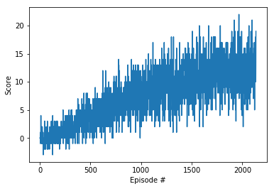

# Project Report

### Learning Algorithim

The learning algorithim used is basic Deep Q Learning as described in this [paper](
https://storage.googleapis.com/deepmind-media/dqn/DQNNaturePaper.pdf)

### Parameters

Replay buffer size:  int(1e5) 
Minibatch size:  64 
Discount Factor:  GAMMA = 0.99 
Soft update of target parameters:  TAU = 1e-3 
Learning Rate:  5e-4 
How often network is updated:  4 

### Neural Network

The Neural Network consists of three fully connected layers.   
The first has an input size equal to the state size, output 64.  
The second input 64, output 64.  
The third input 64, output is the action_size  

Relu activation functions and adam optimizer are used.

### Results

Episode 100	Average Score: 0.02 
Episode 200	Average Score: 0.652 
Episode 300	Average Score: 1.32 
Episode 400	Average Score: 2.14 
Episode 500	Average Score: 3.35  
Episode 600	Average Score: 4.21 
Episode 700	Average Score: 5.17  
Episode 800	Average Score: 6.23  
Episode 900	Average Score: 6.46 
Episode 1000	Average Score: 8.18  
Episode 1100	Average Score: 8.01 
Episode 1200	Average Score: 8.91 
Episode 1300	Average Score: 9.71 
Episode 1400	Average Score: 8.74 
Episode 1500	Average Score: 10.56  
Episode 1600	Average Score: 10.83 
Episode 1700	Average Score: 11.29  
Episode 1800	Average Score: 11.94  
Episode 1900	Average Score: 11.82  
Episode 2000	Average Score: 11.92  
Episode 2100	Average Score: 12.41  
Episode 2135	Average Score: 13.03 
Environment solved in 2035 episodes!	Average Score: 13.03 

### Plot of Rewards

### Future Work

Double Deep Q Network 
Prioritized Experience Replay 
Dueling Deep Q Networks 
Tune hyperparameters 
Learning from pixels 
